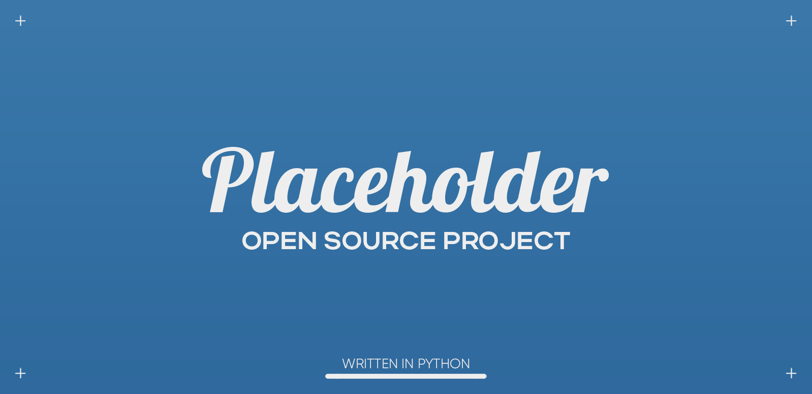

<div align="center">
    <h1>Templates</h1>
    
</div>

## Table of Contents

* [Introduction](#introduction)
* [Technologies Used](#technologies-used)
* [Project Status](#project-status)
* [Version Naming](#version-naming)
* [Setup](#setup)
* [Usage](#usage)
* [Contributing](#contributing)
* [Bug / Feature Request](#bug--feature-request)
* [Room for Improvement](#room-for-improvement)
* [Additional Information](#additional-information)

## Introduction

<!-- Buttons -->

**Templates** is a utility for creating dynamic project templates.

Instead of having a generic copy/paste-able directory for starting new
projects, where after copying you still have to go in and continue setting
up, this library allows you to create organized template files with
{variable names} which can be defined later on when you are actually using
the template. 

## Technologies Used

* Windows OS (x64)
* Python 3.10.5

## Project Status

This project is currently *in development*.

## Version Naming

This library uses semantic versioning:

```
MAJOR.MINOR.PATCH
```

Where an increment in:

* `MAJOR` = Incompatible changes (may require code to be updated).
* `MINOR` = Backwards compatible feature changes.
* `PATCH` = Backwards compatible bug fixes.

## Setup

Getting started...

* Download the [latest version](https://github.com/nicdgonzalez/Templates)
  of this project from GitHub.

* From the command line, find the root directory of the project.
  To install the project, run:

```powershell
# This should automatically insert the package into PYTHONPATH.
# This way it can be called by name (templates).
> pip install "."
```

* Now for demonstration purposes, lets create a dummy project using
  one of the standard templates:

```powershell
# Move to a different directory:
cd ../

# Make a new directory named 'Testing':
mkdir "Testing"

# Set up a new Python project named 'TestLib' in 'Testing':
# This command can also be written using the shorthand flag names:
# python -m "templates" -d <directory> -l <language> -n <name> -r <link>
python -m "templates" --directory ./"Testing" --language py --name "TestLib" --repository "https://github.com/nicdgonzalez/Templates"
```

> **Note**
> Run `python -m "templates" --help` to open the help menu and see all of the
> available argument/flag options.

## Usage

### Adding/Editing the Standard Templates

* Step 1:

```json
"{language}": {
    "/{directory}": {
        "files": ["{destination}::{template}"]
    }
}
```

Where:

    - `language`    = is linked to the --language flag.
    - `directory`   = the name of the target directory to create.
    - `destination` = the name if the file to be created.
    - `template`    = the template in 'templates' directory with the
                      content to copy into `destination`.

* Step 2:

```
```

> **Warning**
> A warning message.

### Adding/Editing Argument Flags

* Step 1:

```
```

* Step 2:

```
```

> **Note**
> The values from the argument flags are automatically added to the Format
> parameters and ready to use in your templates.

> **Warning**
> A warning message.

## Contributing

Want to contribute? Great!

To fix a bug or enhance an existing module, follow these steps:

* Fork the repository.

* Create a new branch

```powershell
> git checkout -b "improve-feature"
```

* Make the appropriate changes in the files.

* Stage the modified files.

```powershell
> git add <file(s)>
```

* Commit changes.

```powershell
> git commit -m "Improve feature."
```

* Push to the branch.

```powershell
> git push "origin" "improve-feature"
```

* Create a [Pull Request](https://github.com/nicdgonzalez/Templates/pulls).

## Bug / Feature Request

If you find a bug (program failed to run and/or gave undesired results)
or you just want to request a feature, kindly open a new issue
[here](https://github.com/nicdgonzalez/Templates/issues).

## Room for Improvement

Areas that could use improvement:

- [ ] Code organization.

Unimplemented features:

- [ ] (?) Rewrite and/or make it class-based instead of a script.

> **Note**
> Features marked with *(?)* indicate that it is unconfirmed whether the feature
> will/will not undergo development.

## Additional Information

* Created by [Nicolas Gonzalez](https://github.com/nicdgonzalez)
  -- feel free to contact me!
